# s3

## S3の概要

ユーザがデータを容量制限なく保存可能なマネージド型で提供されるオブジェクト型ストレージ。

### S3の特徴

- 特徴
  - 高い耐久性: 99.999999999%
  - 安価なストレージ: 1GB/3円
  - スケーラブルで安定した性能: データは冗長化されて保存されデータ容量に依存しない性能がAWS側で保証される。
  - 暗号化: 転送中や保存時にデータを暗号化可能
- データ保存形式
  - バケット: オブジェクトの保存場所。名前はグローバルでユニークな必要あり
  - オブジェクト: S3に格納されるファイルでURLが付与される。バケット内オブジェクト数は無制限
  - データサイズ: データサイズは0から5TBまで保存可能

### S3オブジェクト構成

- Key: オブジェクトの名前であり、バケット内のオブジェクトは一意別する。
- Value: データのものです、バイト値で構成される。
- バージョンID: バージョン管理に用いるID。
- メタデータ: オブジェクトに付随する属性の情報。
- サブリソース: バケット構成情報を保存および管理するためのサポートを提供。
  - 例: ACL

### S3のタイプ

- Standard: 複数箇所にデータを複製するため耐久性が非常に高い
- Standard-IA:
  - スタンダードに比べて安価
  - データの読み出し容量に応じた課金
- One Zone-IA: アクセス頻度は低いが、必要に応じてすぐに取り出すデータ向け
- Amazon Glacier:
  - 最安のアーカイブ用ストレージ
  - データ抽出にコストと時間（3～5時間）を要する
  - ライフサイクルマネジメントで指定
  - ボールロック機能でデータを保持

### S3 Intelligent-Tiering

低頻度アクセスのオブジェクトを自動的に低頻度アクセス層に移動することでコストを削減する。

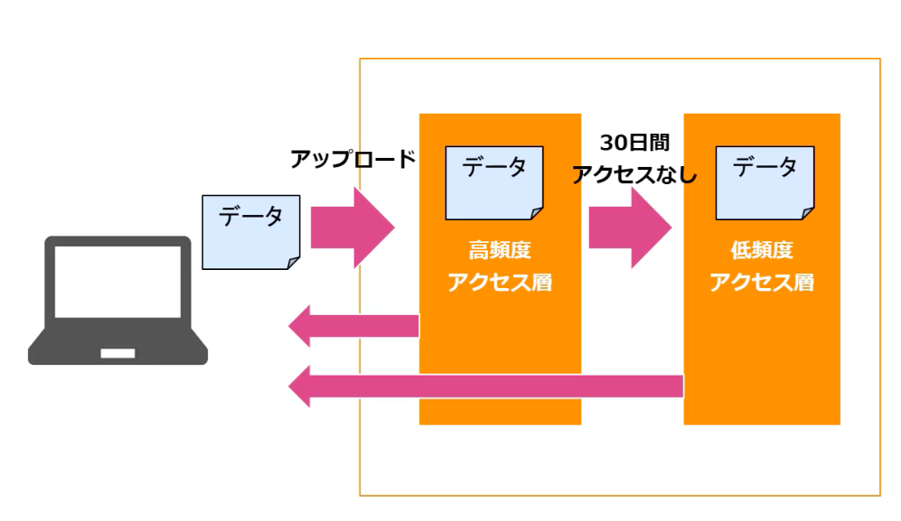

### S3の整合性モデル

S3は高い可能性を実現するため、データ更新・削除には結果整合性モデルを採用。同時書き込みはタイムスタンプ処理を実施。

### S3アクセス管理

- IAM
  - IAMユーザに対してS3サービスへのアクセス権限を設定することができる
  - 一元管理にユーザ権限を管理
- バケットポリシー:
  - バケットへのアクセス権限をJSONで設定
  - 他アカウントへの許可も可能
  - バケット単位の高度なアクセス管理向け
- ACL
  - バケットと個々のオブジェクトへのアクセス権限をXMLで設定する
  - 他アカウントへの許可も可能
  - 簡易的にアクセス管理向け
- 署名付URL: AWS SDKで生成した署名付URLでS3のオブジェクトへの一定時間アクセスを許可
- S3はインターネットからパブリックアクセスの設定が可能

### S3の暗号化

- サーバサイド暗号化
  - SSE-S3
    - S3の標準暗号化方式で簡易に利用可能
    - 暗号化キーの作成、管理をS3側で自動実施
    - ブロック暗号の1つである（AES-256）を使用してデータを暗号化
  - SSE-KMS
    - AWS KMSに設定した暗号化キーを利用した暗号化を実施
    - ユーザ側でAWS KMSを利用して暗号化キーを作成・管理することが可能
    - クライアント独自の暗号化キーを利用可能
  - SSE-C
    - ユーザが指定したキーによるサーバー側の暗号化を使用することが可能
    - 利用設定や管理が煩雑になるのがデメリット
- クライアントサイド暗号化（CSE）
  - クライアント側の暗号化では、Amazon S3に送信する前にデータを暗号化する方式
  - AWS KMSなどを利用して暗号化キーを作成・実施
  - アプリケーション内に保存したマスターキーを使用]

### S3アクセスポイント

S3上の共有データセットを使用するアプリケーションへのダ規模なデータアクセス管理を実施

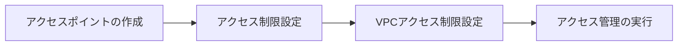

### S3 アクセスアナライザー

アクセスポリシーに沿っているかを確認し、不正なアクセスが発生していないか、アクセスポリシーを監視する機能

### ライフサイクル管理

バケット内のオブジェクト単位でストレージクラスの変更や削除時期などを設定することで実行を自動化する。

- 設定方法:
  - バケット全体やPrefixに設定
  - オブジェクト更新日を基準して日単位で指定し、毎日0:00UTCにキューを実行
  - 最大1000ルール
  - IAに移動できるのは128KB以上のオブジェクト
  - MFA Deleteが有効だと設定不可

### レプリケーション

リージョン間を跨ぐクロスリージョンレプリケーションにより耐障害性を高める

- トリガー
  - バケットに対するオブジェクトの作成、更新、削除をトリガーにレプリケーションを実行する
- 設定
  - バージョンニング機能を有効にする
  - バケットは各別リージョンを指定
  - 双方向レプリケーションも可能
  - データ転送費用が発生

### バージョン管理

ユーザによる誤操作でデータ削除などが発生してもバージョンから復元できる

- 設定
  - バケットをバージョン管理する
  - バージョン保管されたオブジェクトを参照可能
  - バケット削除時に古いバージョンの別途削除が必要

### バックアップ

Glacierを利用してバックアップと復元が実施可能

- アーカイブ
  - 複数リージョンでレプリケーションすることが可能
  - S3オブジェクトデータをライフサイクル設定によりGlacierに移動
- リストア: バージョン管理機能によって削除されたデータを復元するのが基本

### 利用状況の確認

S3の利用状況やS3のイベント発生を確認することができる

- S3の分析
  - データのアクセスパターンの簡易可視化
  - CSV形式で出力可能
  - バケット内の分析を実施
  - アクセス頻度の低いデータや保存期間を確認して、ライフサイクルポリシー設定に生かしていく
- S3のイベント通知
  - バケット内イベントの発生をトリガーにして、SNS/SQS/Lambdaに通知設定が可能
  - シームレスなシステム連携処理を実現

### S3データの解析

S3内のデータ検索・解析には用途に応じて複数サービスから選択が可能

- S3 Select (Glacier Select):
  - S3の内部機能として有している検索機能で、S3内で直接にクエリを実行し、データを取得できる
  - GZIP圧縮データやCSVやJSONに対して実行可能
- Amazon Athena:
  - Amazon S3内のデータを直接、簡単に分析できるようにするインタラクティブなクエリサービス
  - Athena SQLクエリでSageMaker機械学習モデルを呼び出し、機械学習による推論も実行可能
- Amazon Macie:
  - 機械学習によりAmazon S3の機密データを検出、分類、保護する、フルマネージメント型サービス
  - 機密データ検出や調査を実施する
- Amazon Redshift Spectrum:
  - Amazon S3の格納データに対して、Amazon Redshiftから直接クエリを実行できる機能
  - Redshiftクラスターが起動されている前提であるため、Redshiftを利用している場合におすすめ

### マルチパートアップデート

大容量オブジェクトデータをいくつかに分けてアップロードする機能

### バッチオペレーション

S3オブジェクトの大量データに対して一括処理を実行することが可能

- ジョブ:
  - ジョブはS3バッチオペレーションの機能の基本単位で、ジョブを作成することでバッチオペレーションを作成
  - ジョブにはオブジェクトのリストに対して指定された操作を実行するために必要なすべての情報を登録
  - S3バッチオペレーションにオブジェクトのリストを渡し、それらのオブジェクトに対して実行するアクションを指定
- マニュフェスト:
  - マニュフェストとは、Amazon S3が作用するオブジェクトキーをリストするAmazon S3オブジェクト
  - マニュフェストオブジェクトキー、ETag、およびオプションでバージョンIDを指定
  - Amazon S3イベントリレポート/CSVファイルの二つの形式で設定

### オブジェクトロック

> 注: オブジェクトロックはバケットを作成する時点しか有効できない

## S3の用途

### コンテンツ配信・保管

CMSから画像等コンテンツデータの保管先にS3利用する。

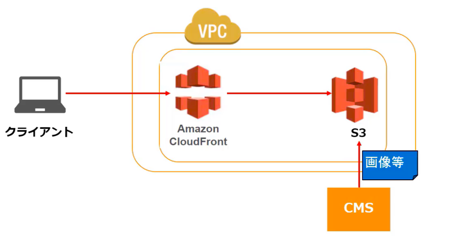

### ログ・バッチの保管場所

ログファイルやバッチファイルの保存場所としてS3利用する

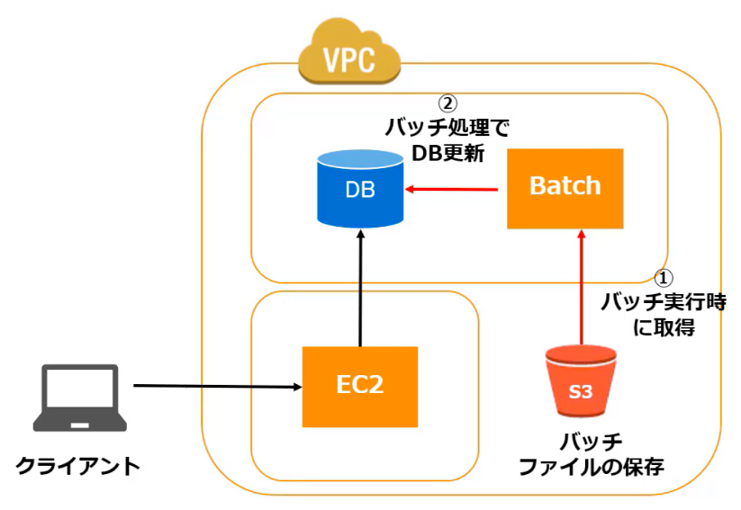

### バックアップ/ディザスタリカバリー

バックアップの中長期の保存場所としてS3を利用する

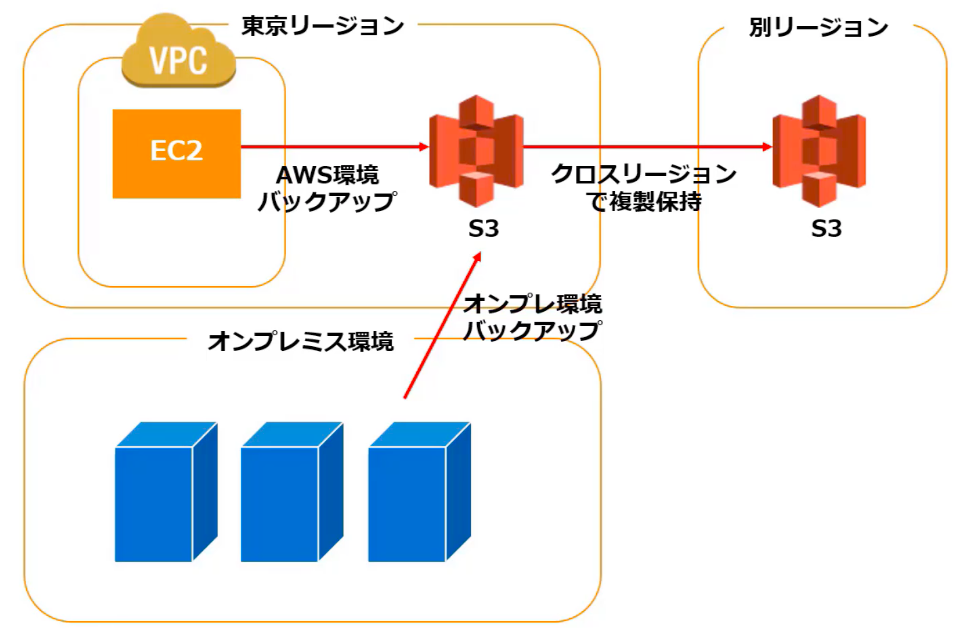

### Webの静的ホスティング

S3のみで静的なWebサイトをホスティングして構築可能

- マネージメントコンソールでバケット単位で指定
- 独自ドメインをバケット名として指定
- 任意のドメインへのリダイレクト機能
- 異なるドメインからのアクセス時にCORSを利用
- CloundFrontとの連携

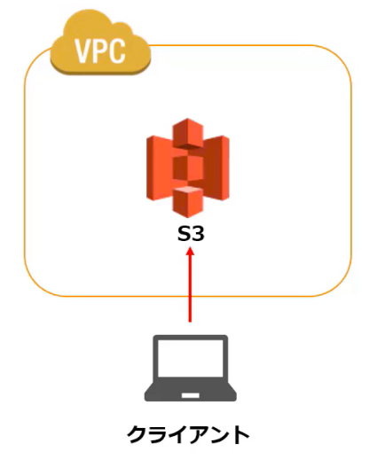

### データレイク

S3はデータレイクとしてデータ活用のハブとして利用できる

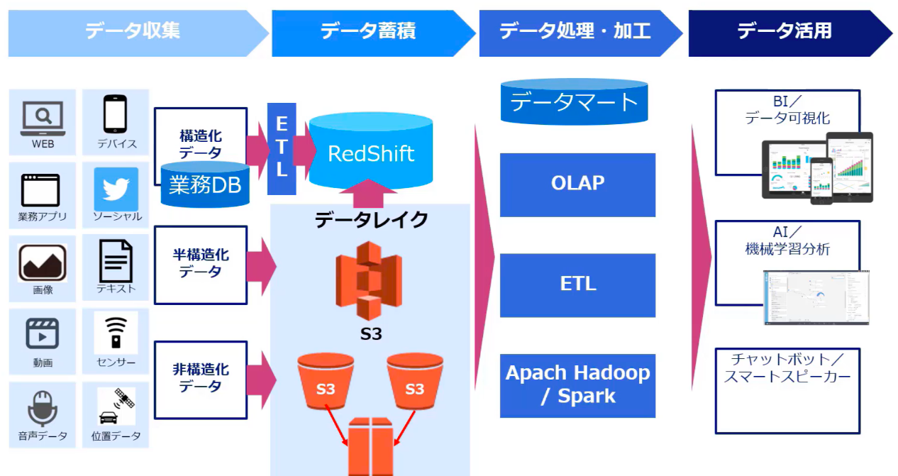

## S3のクロスリアカウントアクセス

別のアカウントのIAMユーザやロールからのアクセスを許可する設定

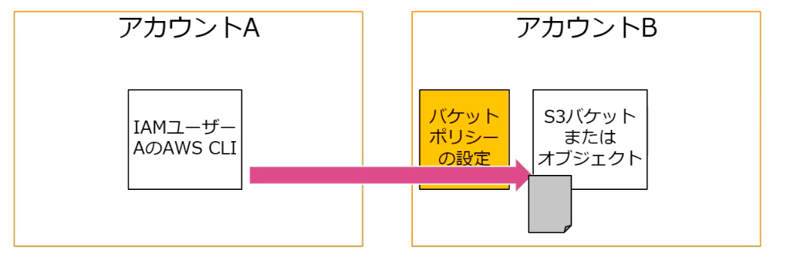

### 方式

1. バケットポリシートIAMポリシーによる許可
   - S3バケットへのアクセスを許可するIAMポリシーを設定する。
   - IAMユーザとロールにIAMポリシーを設定する。
   - S3バケットへのクロスアカウントアクセスを許可する場合はバケットポリシーでアカウントを指定して許可を行う。
2. ACLとIAMポリシーによる許可
   - S3バケットへのアクセスを許可するIAMポリシーを設定する。
   - IAMユーザロールにIAMポリシーを設定する。
   - S3バケットの特定オブジェクトへのクロスアカウントアクセスを許可する場合はACLでアカウントを指定して許可を設定。
3. IAMロールによる許可
   - IAMロールの権限移譲を利用して、S3バケット/オブジェクトへのプログラムによるアクセスまたはコンソールアクセス用のクロスアカウントのIAMロールを設定する。
   - AssumeRoleの実行を許可したロールにより別アカウントのユーザに権限を移譲する。

## オブジェクト所有者

オブジェクトをアップロードしたユーザがオブジェクト所有者になる

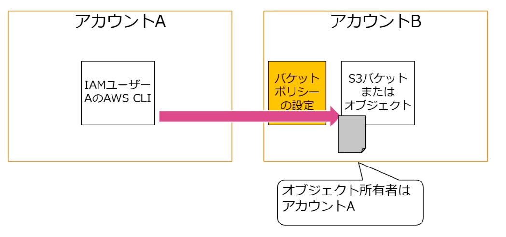

- アップロードしたユーザーがオブジェクト所有者になる。
- デフォルト設定では、オブジェクトにはオブジェクト所有者のみがアクセスできる。
- オブジェクト所有者はアクセス制御で他のユーザにアクセスできるように変更する権限を有する
- 署名付URL作成し、一時的な認証情報を付加することにより、ユーザに期限つきのURLを発行できる。

> 注：アカウントBのバケットにもかかわらず、アカウントAがアップロードしたオブジェクトに権限がないことになる。

## AWS Storage Gateway

標準的なストレージプロトコルを利用して外部システム環境とAWSのストレージサービス

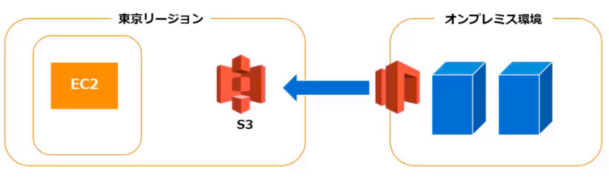

### 利点

- 標準的なストレージプロトコルを活用したシームレスな統合
- キャッシュを活用した低レイテンシなアクセス可能
- AWSストレージサービスの堅牢性・低コスト・拡張性
- 効率的なデータ転送
- AWSのモニタリング・管理・セキュリティとの統合

### 用途

- ビッグデータ処理/クラウドバースティング/システム移行のためにデータをAWSストレージに移動させたいケース
- バックアップ・アーカイブ・災害対策としてAWSにデータを保持
- オンプレミス環境で容易にAWSストレージを活用

### タイプ

- ファイルゲートウェイ：Amazon S3オブジェクトにStorage Gatewayを経由してファイルデータを格納
  - 仮想アプライアンスでNFS v3/V4.1インターフェースを提供
  - 更新データは非同期でAWSに転送
  - ファイルとオブジェクトのマッピングは1対1
  - S3のライフサイクルポリシー/バージョニング/クロスリージョンレプリケーションなどが利用可能
- ヴォリュームゲートウェイ：Amazon S3およびEBSスナップショットをバックエンドとしてブロックストレージ、Disaster Recoverを実現
  - iSCSIでブロックストレージとしてインターフェースを提供
  - オンプレミスのローカルディスクのバックアップを自動的にAWS側で実施
  - 更新データは非同期でAWSに転送
  - オンプレミス側のStorage Gatewayへリストア
  - AWS上でEBSディスクへのリストアも可能
- Amazon S3とGlacierにデータを保管する仮想テープストレージとVTL管理することで、堅牢性の高い外部保管バックアップストレージを実現
  - VTL (Virtual Tape Library)対応バックアップソフトウェアを利用し、Storage Gatewayを経由して、バックアップデータをS3およびGlacierに格納
  - オンプレミスおよびAWSのEC2環境で利用可能
  - バックアップソフトウェアによりデータ取り出しオンプレミスを行うことで、安価なアーカイブストレージを利用
  - 主要なバックアップソフトウェアをサポート

## S3 Transfer Acceleration

クライアントとS3バケットの間で、長距離にわたるファイル転送を高速、簡単。安全に実行

### ユースケース

- 中央のバケットに対して世界中のお客様からアップロードが行われる。
- 大陸間で定期的にギガバイトからテラバイト単位のデータを転送する。
- Amazon S3へのアップロード時にインターネット経由で利用可能な帯域幅を十分に活用できていない。

## Snowball

物理ストレージデバイスを使用し、インターネットを迂回してAWSとの大容量データ転送を高速化するサービス。

- オンプレミスのデータストレージロケーションとAmazon S3との間でデータのインポートおよびエクスポートができます
- Snowballではすべてのリージョンで80TBモデルを使用かのうです。
- 暗号化が強制、保管中や輸送中のデータを保護
- AWS Snowballマネージメントコンソールを使用
- オンプレミスのデータセンターとSnowball間でローカルデータ転送を実行
- Snowballはそれ自体が配送コンテナ

## Amazon S3 Glacier

バックアップ等中長期保存用のS3よりも安価なストレージ。

- S3と同じ耐久性で値段が安い
- データ取得などの迅速性がない

### 特徴

1. データは「アーカイブ」に保存される
2. 一つアーカイブの最大サイズは40TB
3. 保存可能なアーカイブ数とデータ量に制限なし
4. 各アーカイブには作成時に一意のアーカイブIDが割り当てられ、作成後はアーカイブを更新できない
5. アーカイブを保存するためのコンテナとして「ボールト」を使用
6. Amazon S3のライフサイクルルールと連携させることにより、Amazon S3データのアーカイブを自動化し、全体的なストレージコストを削減
7. AES256ビット大賞対称鍵を使用してデフォルトで自動的に暗号化
8. S3と違って直接データをアップロード・取得という処理ができないため、S3ライフサイクル管理から、プログラム処理によるアップロード/ダウンロードが必要
9. Glacierの最低保持期間は90日

### Glacierの仕組み

S3と異なり、ボールトとアーカイブという単位でデータを保存

- ボールト
  - ボールトはアーカイブを格納するコンテナ
  - ボールトはリージョンに作成
- アーカイブ：
  - アーカイブは、写真、動画、ドキュメントなどの任意のデータで、S3 Glacierでのストレージの基本単位
  - 各アーカイブは一意のアドレスを持ちます
- ジョブ：アーカイブにSELECTクエリを実行したり、アーカイブを取得したり、ボールトのインベントリを取得したりする実行単位
- 通知設定：ジョブ完了には時間がかかるため、ジョブの完了時にSNSと連携した通知設定が可能

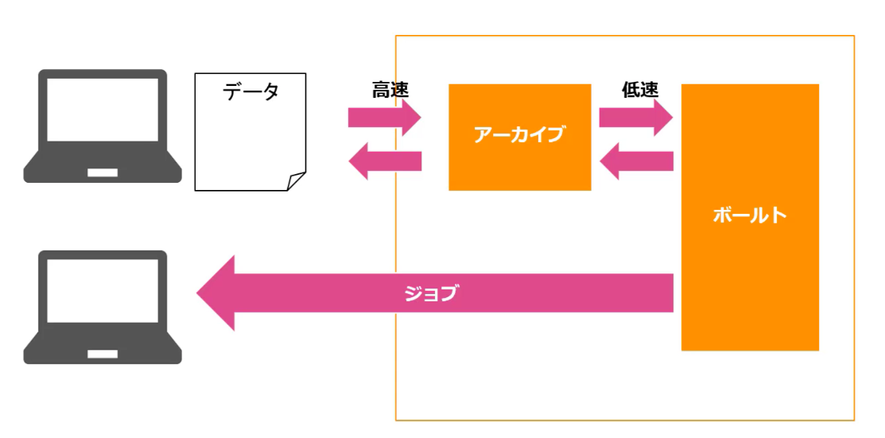

### Glaciernのデータ取得タイプ

Glacierのデータ取得タイプの設定に応じてデータ取得時間と取得時の料金が変わる

- 迅速：アーカイブのサブセットが迅速に必要になった場合にデータに素早くアクセスするモード。通常１～５分間で使用可能になる
- プロビジョニングキャパシティー：迅速取り出しの取得容量を必要なときに利用できることを保証する仕組み
- 　
- 大容量：最も安価な取り出しオプションであり、大量のデータを一日以内に低コストで取得できます。通常、大容量取り出しは５～１２時間で完了。

### アクセス管理

Glacierのアクセス管理は用途に応じて方式を使い分ける。

- IAM
  - IAM ユーザーやリソースに対してS3サービスへのアクセス権限を設定する
  - 一元的にリソースへのアクセス権限を管理
- ボールトポリシー：ボールトで直接アクセスポリシーを定義して、組織内ユーザーや社外ユーザに対してもボールトへのアクセス権限を付与
- データ取り出しポリシー
  - データ取り出しに関する制限を定義
  - 「無料利用枠のみ」に制限。または無料利用枠を超える量を取り出したい場合は、「最大取得率」を指定すると、取り出し速度を制限して、取り出しコストの上限を設定
- ボールトロックポリシー：ロックによって変更を禁止することにより、コンプライアンス管理を強力に実施することが可能
- 署名：認証保護のために、全リクエストに署名が必要

### Glacier Deep Archive

Glacierよりも値段が安くデータ保存が可能だが、データ取得はさらに遅くなる中長期保存用ストレージタイプ

- Glacierよりさらに値段が安い
- Glacierよりさらにデータ取得が遅い
