# Well-Architected Framework

## AWSアーキテクチャ設計の基礎

### AZの選択

1. 一つのリージョンにつき二つのAZを利用してアーキテクチャを設計することが基本（三つ以上はコスト効率が低下する）

    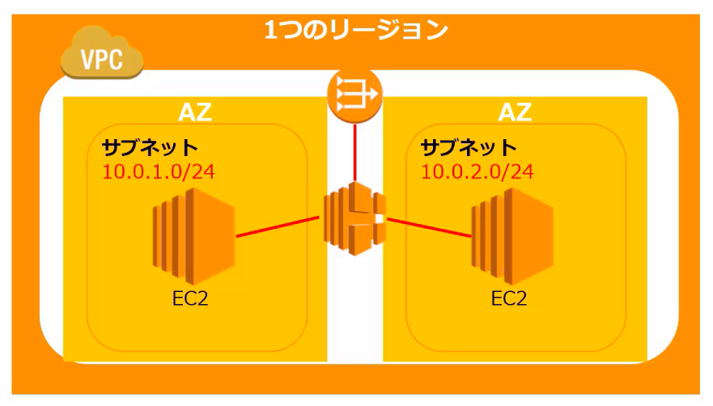

2. マルチAZにサーバーやDBの冗長構成を確立させることで高い可能性を実現する

    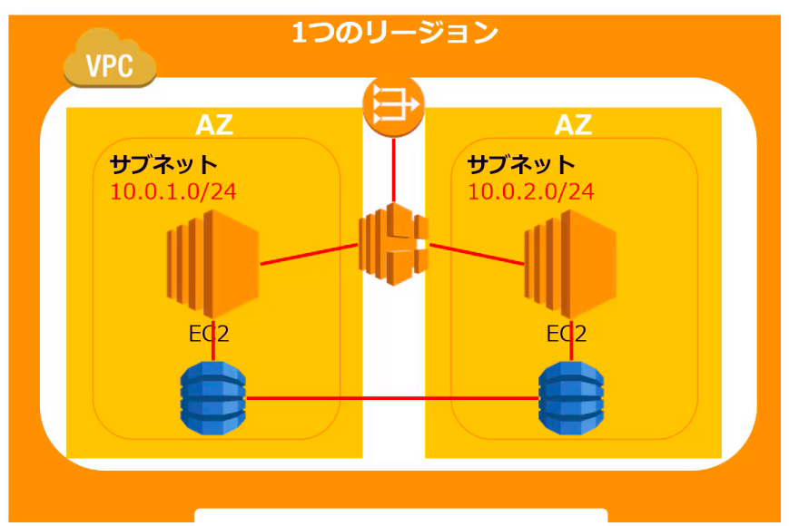

### VPC

二つ以上のVPCでアーキテクチャを設計するのが基本となる

- 一つのVPC
  - 可用性が低下するため、アイデンティティ管理やハイパフォーマンスコンピューティングなどその用途は限られる
  - 一人などの小規模で利用する場合は二つ以上VPC利用するのが面倒なケースもある
- 二つ以上のVPC: 二つ以上のVPCで可用性を確保するのが適切なAWSアーキテクチャ設計となる

1. 二つ以上のVPCに分けてアーキテクチャを配置することで利用範囲を分割する

    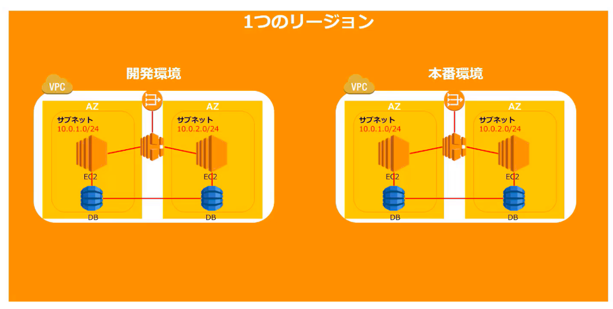

2. マルチVPC方式
    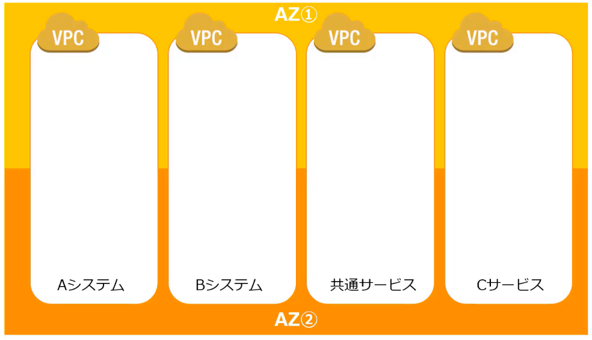

3. マルチアカウント方式

    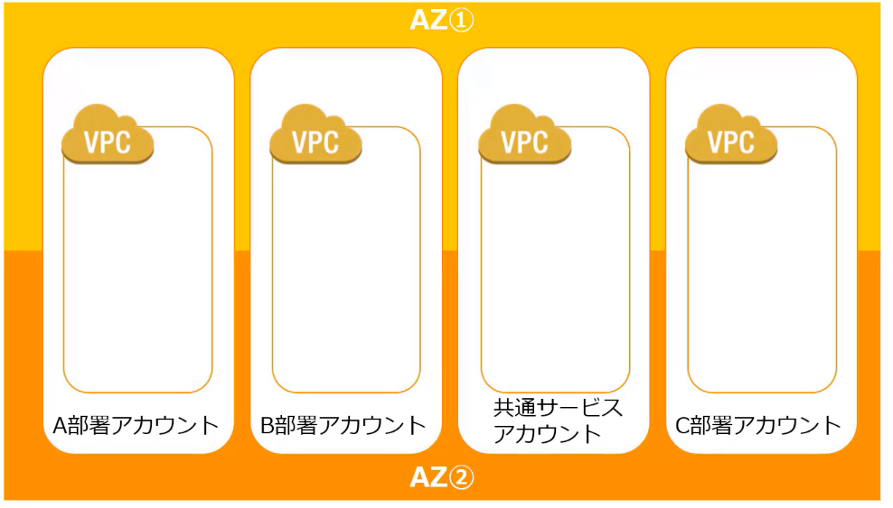

### サブネットの分割

- パブリックサブネット
  - インターネットと接続が必要なリソースを揃える
  - インターネットとアクセス制御に利用する
  - ウェブアプリケーションのインターネットアクセス制御
- プライベートサブネット
  - インターネットから隔離することでセキュリティを高める
  - データベース処理
  - バッチ処理インスタンス
  - バックエンドのインスタンス

サブネットのサイズは「/24」以上の大きいサブネットを推奨

1. 一つのAZに対して一つのパブリックサブネットと一つのプライベートサブネットが基本

    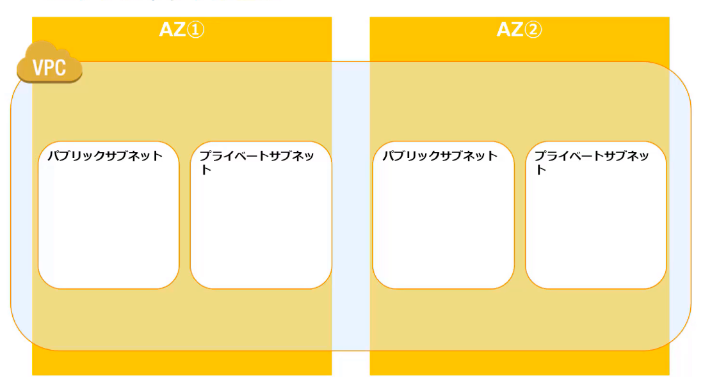

2. プライベートサブネットに多くのIPアドレスを割り当てる

    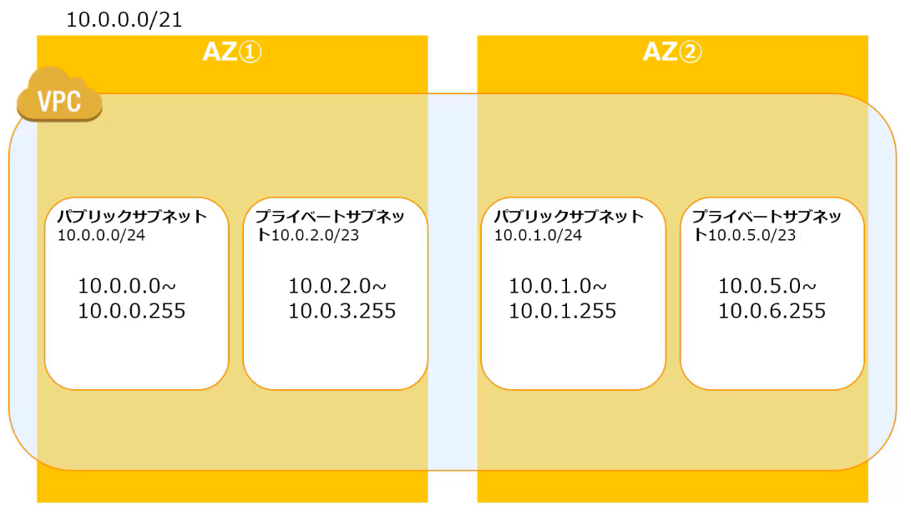

### VPC間接続の設計

1. VPC peeringにより二つのVPC間でのトラフィックルーティングが可能

    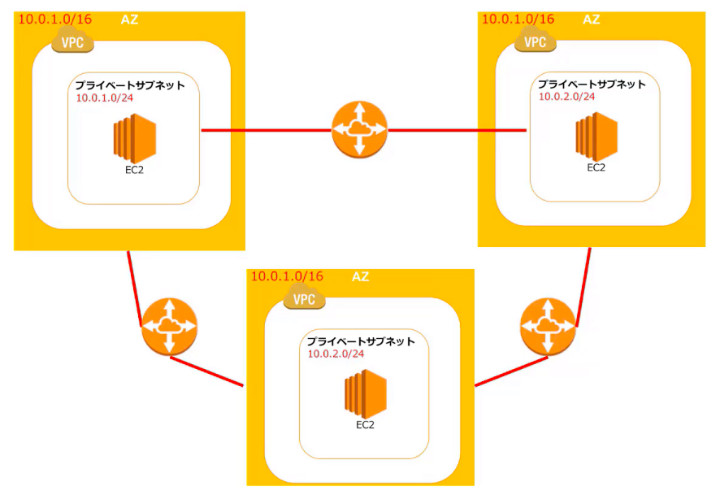

2. 接続が必要なVPCはそれぞれPeeringが必要となります。この場合、AとBは接続がない

    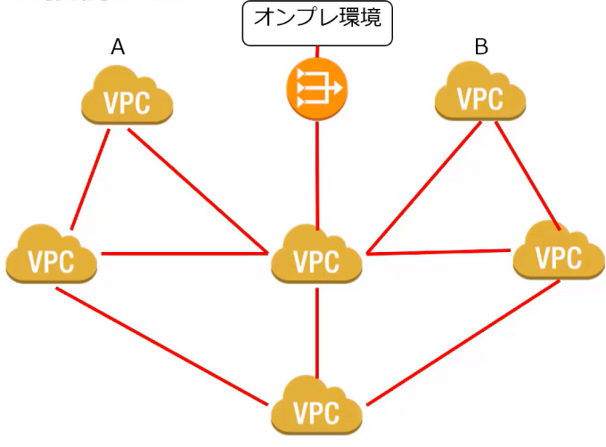

## 設計原則

### 信頼性

障害による中断・停止と障害復旧による影響を軽減するインフラを構成する

- インフラサービスの障害復旧の自動化など軽減設計
- 復旧手順テストによる検証
- 需要変化に応じた水平方向へのスケーラビリティに高可用性の確保
- キャパシティーの推測をやめる
- モニタリングと自動化を進める

信頼性の主要サービス

- 基盤: IAM、VPC、Auto Scaling、ELB、Cloud Formation
- 変更管理: Cloud Trail、Cloud Config
- 障害管理: Cloud Watch

### パフォーマンス効率化

システム要件のリソース最適化によるインフラの効率化

- システム要件を満たすためのコンピューティングリソースを効率化する
- システム要件やAWSサービスの進化に応じてAWSインフラの効率化を推進する
  - 先端技術の一般化
  - グローバル化を即座に達成
  - サーバレスアーキテクチャの利用
  - より頻繁な実験

パフォーマンス効率化の主要サービス

- コンピューティング: Auto Scaling、Lambda
- ストレージ: EBS、S3、Glacier、EFS
- データベース: RDS、DynamoDB、Elastic Search、Aurora、Redshift
- 容量と時間のトレードオフ: Clound Front、Elastic Cache

### セキュリティ

AWS内のデータ/システム/アセットの保護とモニタリングによりセキュリティを高める

- 全てのレイヤーのセキュリティを適用
- アクセス追跡・モニタリングを確実な実施
- 条件ドリブンのアラートをトリガーとしてセキュリティイベントの応答を自動化
- AWS責任共有モデルに基づく対称範囲の保護に集中する
- セキュリティのベストプラクティスの自動化
  - ソフトウェアベースのセキュリティ設定を使用し、迅速でコスト効率の良いスケーリングを安全に実行する
  - 仮想サーバーのカスタムベースラインイメージによる新サーバーへの適用自動化
  - インフラ全体のテンプレート化による管理

セキュリティの主要サービス

- データ保護: ELB、EBS、S3、RDS、KMS
- 権限管理: IAM、MFA
- インフラ保護: VPC
- 検出制御: Cloud Trail、Cloud Watch、AWS Guard Duty、Amazon Inspector

### コスト最適化

不要なリソースの削減や最適な料金選択によりコストを削減

- 不必要なリソース削減
- 透明性のある費用を課する
- マネージメント型サービスの利用によるコスト削減
- こての償却コストを変動コストへと転換
- スケールによるコストメリット
- データセンターへの投資不要化

コスト最適化の主要サービス

- 需要と供給の一致: Auto Scaling
- コスト効率の高いリソース: EC2購入、Trusted Advisor
- 支出の認識: Cloud Watch、見積もりツール
- 継続した最適化: AWS最新情報、Trusted Advisor

### 運用上の優秀性

運用上の優秀性とは計画変更が起こった場合や予期せぬイベントの発生時において、自動化された運用実務および文書化されテストされレビューされた手順があること

- コードに基づく運用実施
- ビジネス目的に沿って運用手順
- 定期的かつ小規模で増加的な変更実施
- 予期せぬイベントへの応答テスト運用イベントと障害から学習
- 運用手順を最新のものに保持すること

運用上の優秀性の主要サービス

- 準備: Cloud Formation、Cloud Seris、Runbook Playbook
- 運用: System Manager、Service Catalog、Cloud Trail、Aws Artifact、AWS Guard Duty、Cloud Watch、AWS Config、API Gateway
- 進化: 継続的かつ段階的な改善のために時間とリソースを割り当て、運用の有効性と効率性を向上させる

## AWSのベストプラクティス

### 11のベストプラクティス原則

1. スケーラビリティの確保
   - 需要の変化に対応できるアーキテクチャを設計する
   - 関連する主要サービス: EC2 Auto Recovery、EC2 Auto Scaling、Cloud Watch、RDS、DynamoDB

2. 環境の自動化
   - システムの安定性・整合性および組織の効率を改善するため主要プロセスを自動化する
   - 関連する主要サービス: Cloud Formation、Codeシリーズ、ECS、Elastic Beanstalk、OpsWorks、Cloud Watch

3. 使い捨てリソースの使用
   - サーバーなどのコンポネントを一時的なリソースとして利用・設計する
   - 関連する主要サービス: EC2、Auto Scaling

4. コンポネントの疎結合
   - コンポネント間の相互依存を減らした構成とすることで、１つのコンポネント変更や障害の影響を削減する
   - 関連する主要サービス: ELB、SNS、SQS

5. サーバレス
   - マネージド型サービスとサーバレスアーキテクチャより効率的な設計と運用を実現
   - 関連する主要サービス: Lambda、SNS、SQS、ELB、SES、DynamoDB、Amazon API Gateway、Amazon Cognito

6. 最適なデータベース選択
   - ワークロードに応じた最適なデータベース技術を利用する
   - 関連する主要サービス: RedShift、RDS、Dynamo DB、Aurora、Elastic Search

7. 増大するデータ量対応
   - IoT/ビッグデータなどで絶えず増加するデータの保持を効率的に実施する
   - 関連する主要サービス: S3、Kinesis、Clacier

8. 単一障害点の排除
   - AWSのサービスの多くは高可用性が保証されているものが多いものの、以下の主要サービスはELBなどによる高可用性設計が必要
   - アーキテクチャで高可用性を実現すべきサービス: EC2、Direct Connect、RDS
   - 利用する主要サービス: ELB

9. コスト最適化
   - リソースが適切なサイズから必要に応じたスケールアウト・スケールインの実施と最適な料金プランの選択

10. キャッシュの利用
    - 繰り返し取り出すデータやコンテンツについてはキャッシュを利用する構成とする
    - 関連する主要サービス: Clound Front、Elastic Cache

11. セキュリティの確保
    - すべてレイヤー・境界・リソース内/外においてセキュリティを実装する

### 5つの設計原則と11のベストプラクティス

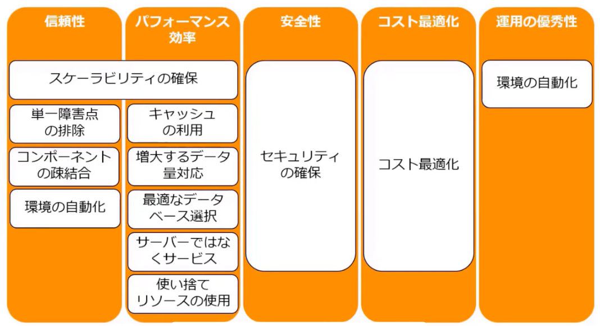

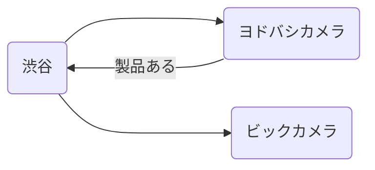

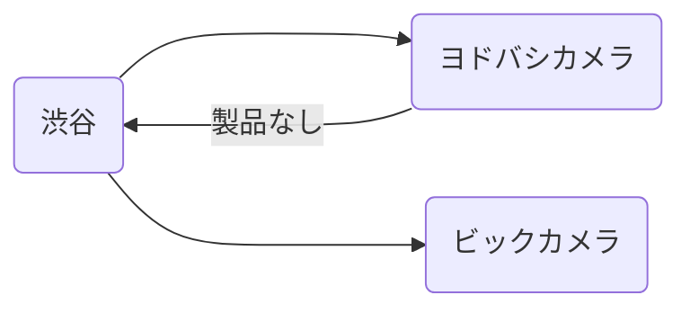

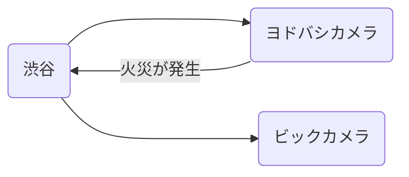

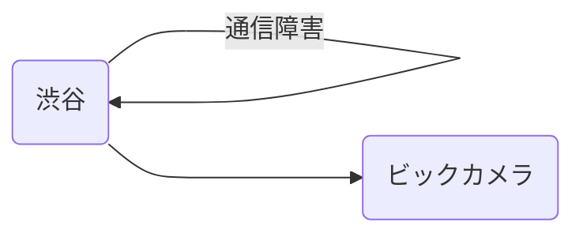

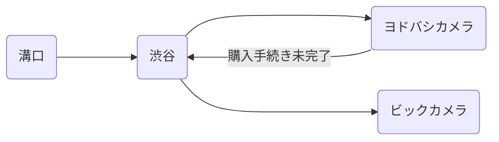
