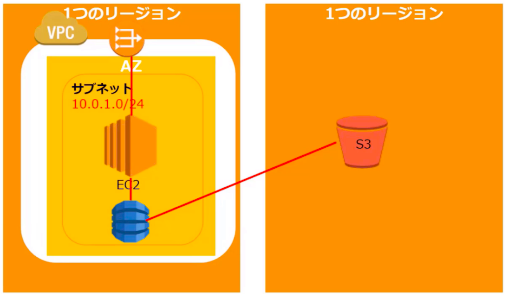
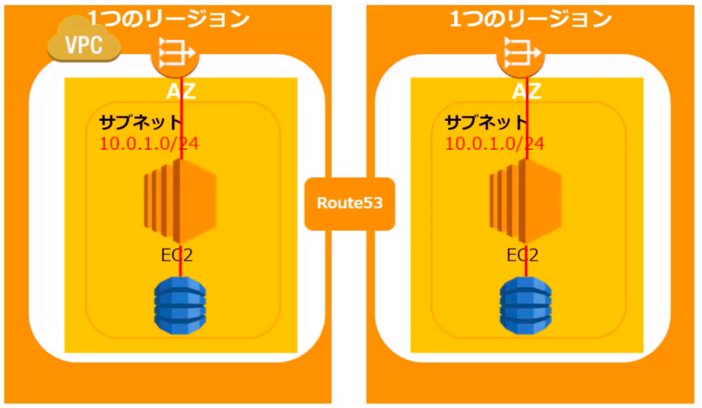
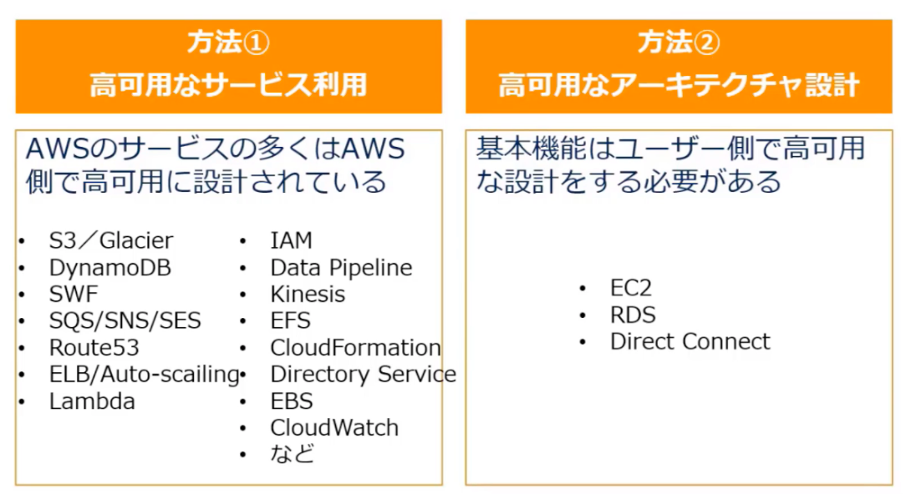
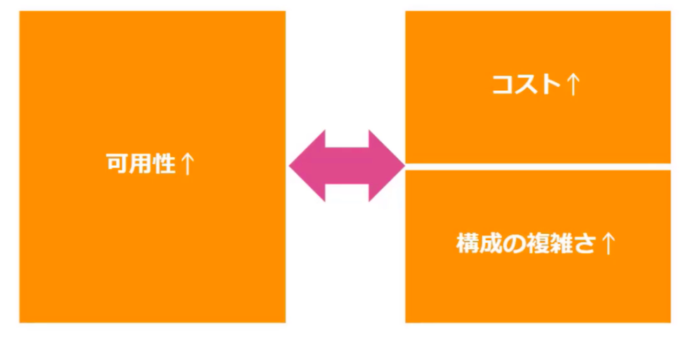
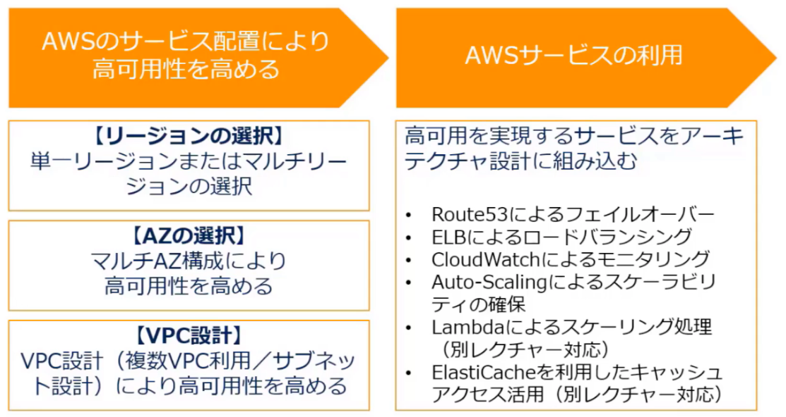
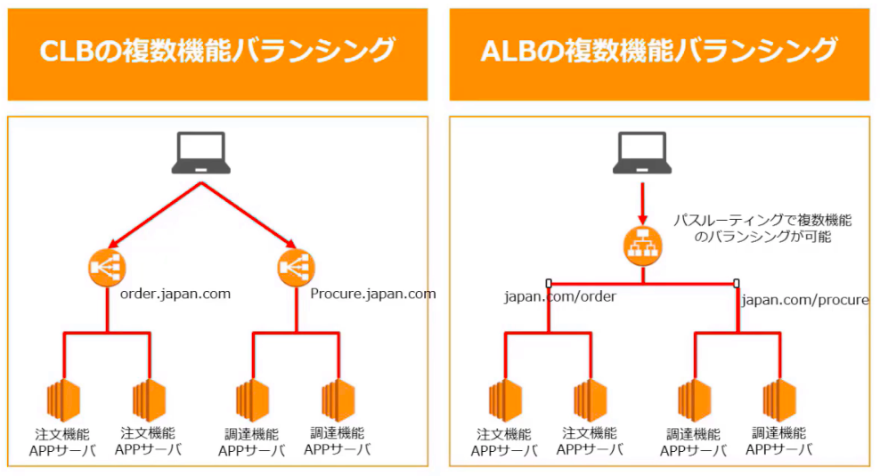
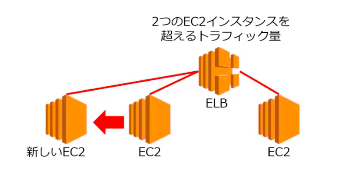
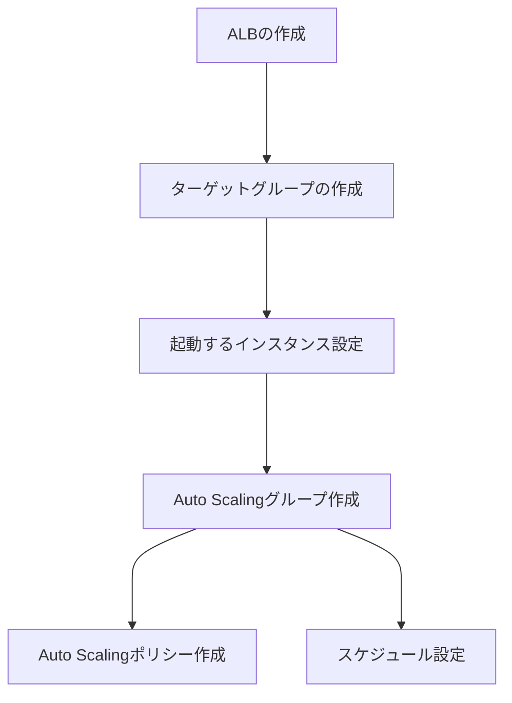
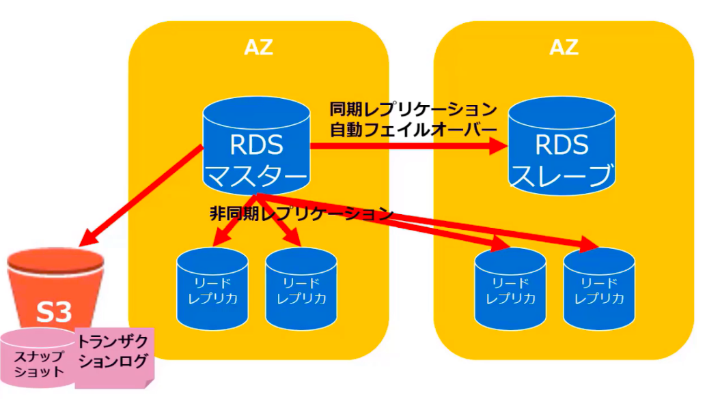
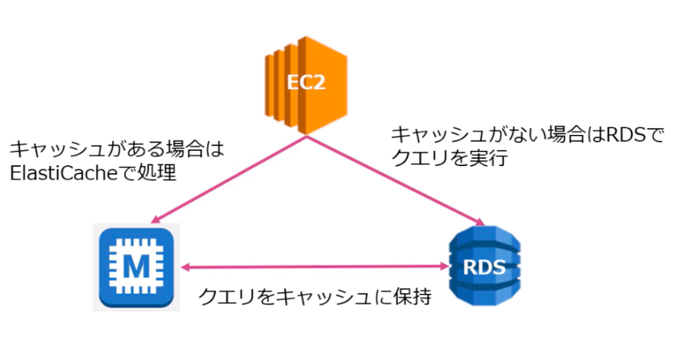

# Reliability

## 耐障害性の向上

- 別リージョンや別AZにバックアップを取得保管することで耐障害性高める。

    

- 別リージョンや別AZへのスタンバイ構成をとることで即座にフェイルオーバーできるようにする。

    

- 事業継続性計画（BCP）を整備し、バックアップからの復元やフェイルオーバーなどの手順を検証する

    ```mermaid
    graph LR
      BCPの整備 --> 復元/フェイルオーバー手順の確認
    ```

## 高可用性の確保



### 高可用性の非機能要件

- 目標復旧時間（RTO）: いつまでにシステムが復旧するかという目標時間を表す指標。
- 目標復旧時点（RPO）: システム障害などでデータが損害した際に、復旧するバックアップデータの古さの目標。
- 耐障害性: アプリケーションのコンポーネントに組み込まれた冗長性。
- 復元可能性: システム障害/災害発生時におけるサービス復旧に係る機能とプロセスとポリシー。
- 拡張性: 既存設計・構成において、アプリケーションの拡張性を確保する能力。

### 高可用性のトレードオフ



### 高可用性のポイント



### 単一障害点の排除の方法

- 単一AZで単一VPCのシンプルな構成をとると単一障害点（SPOF）によりシステムダウンに弱くなる。
- 基本はELBを利用したマルチAZまたはマルチVPCにより、単一障害点を排除するアーキテクチャ設計を実施。
- マルチAZでマスタースレーブ構成をとって自動フェイルオーバーで切り替え可能で、かつリードレプリカで負荷を軽減。
- インスタンス障害に対してはElastic IPを設定して、同じパブリックIPを持つ別のインスタンスにIPをフローティングする。

## ELB

マネージド型のロードバランシングサービスで、EC2インスタンスの処理を分散する際に標準的にりようする。

### 特徴

- インスタンス間の負荷を分散する
- 異常なインスタンスを認識して対応する
- パブリック/プライベートどちらでも使用可能
- ELB自体も負荷に応じてキャパシティーを自動増減するスケーリングを実施
- 従量課金で利用可能
- マネージドサービスなので管理が不要
- Auto Scaling、Route 53、Cloud Formationなどと連携

### ELBの主要機能

- ヘルスチェック: EC2インスタンスの正常/異常を確認し、利用するEC2の振り分けを行う
- 負荷分散: 配下のEC2の負荷に応じて、複数のAZに跨るEC2インスタンスの負荷分散を行う
- SSLサポート: ELBでSSL Terminationできる
- スティッキーセッション: セッション中に同じユーザから来たリクエストを全て同じEC2インスタンスに送信する
- Connection Draining: インスタンスが登録解除されるか異常が発生した場合に、そのバックエンドインスタンスへの新規リクエスト送信を中止する
- S3へのログ保管: ELBのアクセスを指定したS3に自動保管

### ELBの種類

1. Classic Lod Balancer: 初期に提供されたELBであり、標準的なL4/L7におけるロードバランシングが可能だが複雑な設定はできない
   - HTTP/HTTPSとTCP/SSLプロトコルのL4とL7に対応
   - Proxyプロトコルによる発信元IPアドレス識別
   - ELBとバックエンドのEC2間でHTTPS/SSL使用時にサーバ証明書認証を実施
   - CLB配下のインスタンスは、全て同一の機能を持ったインスタンスが必要
   - 異なる機能二たいしてコンテントベースルーティングはできない
2. レイヤー7の対応が強化された単一ロードバランサーで、異なるアプリケーションへリクエストをルーティングが可能
   - URLのパスに基づいてルーティングが可能なパスベースルーティングが可能
   - WebSocketとHTTP/2のリクエストを受付
   - 1インスタンスに複数ポートを登録可能
   - EC2インスタンスをターゲットグループに割り当てる際、複数ポートを個別のターゲットとして登録することが可能なため、ポートを利用するコンテナをロードバランシング可能
   - ターゲットグループのヘルスチェックが可能
   - アクセスログの情報追加
   - EC2と同様に削除保護が可能
   - ALB自体が自動的にキャパシティーを増減
3. NetWork Load Balancer: NLBは超低遅延で高スループットを維持しながら秒間何百万リクエストを捌くように設計された新しいロードバランサー
   - 開放型システム間相互接続（OSI）モデルの固定IPアドレスを持つL4ロードバランサー
   - 揮発性ワークロードを処理し、毎秒数百万のリクエストに対応できる能力
   - VPC外のターゲットを含めたIPアドレスや静的IPアドレスでの登録可能
   - 複数のポートで各インスタンスまたはIPアドレスを同一ターゲットグループに登録可能
   - 大規模アクセスが予測される際にCLBやALBで必要だったPre-warming申請が不要
   - ALBやCLBはX-Forwarded-Forでアクセス元IPアドレスを判断していたが、NLBは送信元IPアドレスと送信元ポートの書き換えを行わないため、パケットからアクセス元が判断可能
   - NLBはフォルトトランス機能を内臓したコネクション処理を持ち、数カ月から数年のオープンなコネクションを処理できる
   - コンテナ化されたアプリケーションのサポート
   - 各サービスの個別のヘルスステータスのモニタリングのサポート

### CLBとALB

ALBはパスルーティングによりCLBより容易にバランシング構成が可能



## Auto Scaling

### スケーラビリティの確保

需要増にトラフィック量が処理出来なくなる前に、処理サーバーを拡張することで対処する必要がある。



### スケーリングのタイプ

|分類|垂直スケーリング|水平スケーリング|
|-----|------|----|
|拡張|スケールアップ：メモリやCPUの追加・増強|スケールアウト：処理する機器/サーバ台数を増加する|
|低減|スケールダウン：メモリやCPUの削減・低性能化|スケールイン：処理する機器/サーバ台数を低減する|

Auto Scalingは水平スケーリングです

### Auto Scalingグループ

スケールするインスタンスの最大数など基本情報を設定する

- 起動インスタンスの最小数と最大数を設定する
- 現時点で必要な最適なインスタンス数の数量になるようにインスタンスを起動/終了を調整
- 起動台数をAZ間でバランシングする
- AZ障碍時は障害のない別のAZその分のインスタンスを起動する

### Auto Scaling Configuration起動設定

スケールアウトの際に起動するインスタンス内容を設定する

- AMI
- インスタンスタイプ
- セキュリティグループ
- キーペア
- IAMロール

### Auto Scaling Plan

どのようにスケールするかの方法を定義する

- Auto Scaling Groupサイズの維持：現在のAuto Scaling Groupのインスタンス最小台数を維持する設定をする
- 手動スケーリング：設定外で予期せぬスケーリングが必要となった場合に手動でスケーリングを実施
- スケジュールベース：予測された需要増時期に合わせたスケーリングスケジュールを設定
- 動的スケーリング：予測不能なケースにスケーリングポリシーにスケール方針を設定して、動的にスケールアウトを実施

### ヘルスチェック

Auto Scaling配下のEC2のヘルスチェックにはEC2のステータス情報またはELBのヘルスチェックのどちらかを利用する

- EC2ステータス：インスタンスのステータスがrunning以外の状態を異常と判断
- ELB：ELBのヘルスチェック機能を活用する

### ターミネーションポリシー

需要減に基づくスケールインの際にどのインスタンスから終了するかを設定

1. OldestInstance/NewestInstance：最も古いインスタンスや新しい起動時刻のインスタンスなどの順から終了
2. OldestLaunchConfiguration：最も古い起動設定により起動しているインスタンスから終了
3. ClosestToNextInstanceHour：次の課金が始まるタイミングが最も近いインスタンスから終了
4. デフォルト設定：2番3番の順に適用する。その後、複数インスタンスが残った場合はランダムに終了する。

### Auto Scalingの設定プロセス



### Auto Scalingの設定ポイント

- インスタンスの最大値/最小値の設定は慎重に設定する
- ステートフルなアプリケーションへの設定には、Auto Scaling Groupでの自動設定が必要
- ライフサイクルフック（起動時または削除時にインスタンスを一時停止してカスタムアクションを実行）を使用
- Auto Scalingスラッシング（急なスケールインによる影響）を避ける

## RDS

RDSは様々なデータベースソフトウェアに対応したフルマネージドなリレーショナルデータベース

### RDSの制約事項

- バージョンが限定される
- キャパシティーに上限がある
- ＯＳへのログインができない
- ファイルシステムへのアクセスができない
- IPアドレスが固定できない
- 一部の機能が使えない
- 個別パッチは適用できない

### RDSの特徴

- RDS自体がマネージド型の高可用なのに加え、マルチAZによるMaster/Slave構成を容易に構築することができる
- 参照専用のレプリカを最大5台（Auroraは15台）設置し、DBの読取処理をスケールアウトできる
- 自動/手動でスナップショットを取得して保存管理し、耐障害性を確保



### スケーリング

マネージメントコンソールやAPIからスケールアップ可能

- インスタンスタイプを変更してスケールアップ/ダウンを実施
- コマンドライン（AWS CLI）やAPIからストレージを数クリックで容易にスケールアップ/ダウンをする
- 一時的にインスタンスタイプを大きくして、その後戻すことも可能
- ストレージサイズは、拡張はできるが縮小はできない

データベースのパフォーマンス低下に対してスケーリング対応を実施することが求められる

#### RDSのスケーリング方式はスケールアップとスケールアウト

- スケールアップ：
  - インスタンスサイズの変更
  - インスタンスタイプの変更
  - ストレージタイプの変更
- スケールアウト：リードレプリカの増設、キャッシュによる高速化が可能。また、全く別DBへ変更するAuroraへの移行も実施可能
  - リードレプリカの増設：読込処理のアクセス集中を分散化するため、読込専用となるリードレプリカを増設して、負荷分散する。
  - キャッシュの利用：Elastic Cacheを連携またはMySQL Memcached機能を利用してキャッシュを増設し、読み処理の高速化を実施する。
  - Auroraへの移行：正確にはスケールアウトとはことなりますが、RDS MySQLを高性能なAurora MySQLへと移行することで、性能をアップさせることが可能です。

### DBインスタンスの暗号化

保管時のインスタンスとスナップショットの暗号か可能

- 暗号化対象
  - DBインスタンス
  - 自動バックアップ
  - リードレプリカ
  - スナップショット
- 暗号化方式
  - AES-256暗号化
  - AWS KMSによる鍵管理
  - リードレプリカも同じ鍵を利用
  - インスタンス作成時にのみ設定可能
  - スナップショットのコピーの暗号化/リストア可能

### RDSの構成比較

|項目|マルチAZ配置|マルチリージョン配置|リードレプリカ|
|---|----------|-----------------|------------|
|目的|高可用性|災害復旧とローカルパフォーマンス|スケーラビリティ|
|同期方式|Aurora以外：同期レプリケーション；Aurora：非同期レプリケーション|非同期レプリケーション|非同期レプリケーション|
|アクセス|Aurora以外：プライマリインスタンスのみがアクティブ；Aurora：全インスタンスがアクティブ|すべてのリージョンにアクセスでき、読取に使用できる|全てのリードレプリカにアクセス可能で、読込のスケーリングに使用可能|
|バックアップ|Aurora以外：自動バックアップはスタンバイから取得され；Aurora：自動バックアップは共有ストレージレイヤーから取得される|デフォルトではバックアップは構成されない|
|配置|一つのリージョン内に常に二つ以上のAZを展開|各リージョンに対してマルチAZ配置が可能|AZ内、AZ間、またはリージョン間に配置可能|
|切替|問題が検出された場合のスタンバイ|Auroraは、Secondリージョンのプロモーションをマスターに昇格可能|手動でスタンダードアロンデータベースに昇格可能。Auroraはプライマリインスタンスに昇格可能|

### キャッシュの利用

読込処理の一部をキャッシュとして保持して、高速リクエスト処理を実現する構成が可能

- Elastic Cache：AWSが提供するインメモリDBサービスである、Elastic Cacheを利用してリクエスト処理をインメモリDBに保持して高速処理を可能にする。
- MySQLオプション機能の利用：MySQLのオプション機能にあるMemcachedを利用してインメモリキャッシュを利用する。


