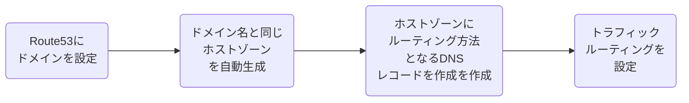

# Route53

## 概要

Route53はAWSが提供する権威DNSサーバー、ポート53で動作することからRoute53と呼ばれる。

- 主要機能はドメイン登録/DNSルーティング/ヘルスチェック
- ポリシーによるルーティング設定
- トラフィックルーティング/フェイルオーバー/トラフィックフローに基づく様座な条件のルーティング設定が可能
- AWS側100%可用性を保証するSLA
- マネージドサービスとして提供しており、ユーザ側で冗長性などを考慮する必要がない

### Route53の利用方法

### ホストゾーン

ドメインとそのサブドメインのトラフィックルーティングする方法についての情報を保持するコンテナ

- パブリックホストゾーン
  - インターネット上に公開されたDNSドメインコードをかんりするコンテナ
  - インターネットのDNSドメインいにたいするトラフィックルーティング方法を定義
- プライベートホストゾーン
  - VPCに閉じたプライベートネットワークのDNSドメイン」のレコードを管理するコンテナ
  - VPC内のDNSドメインにたいして、どのようにトラフィックルーティングするかを定義
  - 一つのプライベートホストゾーンで複数VPCに対応
  - VPCが相互アクセス可能であれば複数リージョンのVPCでも、同じホストゾーンを利用可能

### DNSレコード

- SOA: ドメインのDNSサーバー/ドメイン管理者のメール・アドレス/シリアル番号などを保持して、ゾーン転送時に情報が更新されているかの判断に利用する
- A: ホスト名とIPアドレスの関連づけを定義するレコード
- MX: メールの配送先のホスト名を定義するレコード
- CNAME: 正規ホスト名に対する別名を定義するレコード。特定のホスト名ドメイン名に転送する時などに利用する

#### ALIASレコード

- DNSクエリにAWSサービスのエンドポイントのIPアドレスを返答
- 以下のサービスを設定可能
  - 静的ウェブサイトとして設定されたS3バケット
  - CloudFront
  - ELB
  - ホストゾーン内のリソースレコードセット
- メリット
  - DNSクエリに対するレスポンスが高速
  - CNAMEにマッピングできないZone Apexを設定可能
  - ALIASレコードに対するクエリが無料であり、Route53と連携したDNS Lookupを高速かする
  - CloudFrontでのクエリ回数を削減

## トラフィックルーティングのタイプ

- シンプルルーティング（Simple）
  - レコードセットで事前に設定された値のみに基づいてDNSクエリに応答する
  - 静的なマッピングによりルーティングを決定
- 加重ルーティング（Weighted）
  - 複数エンドポイント毎の重み設定によりDNSクエリに応答する
  - 重みつけの高いエンドポイントに多くルーティング
- フェイルオーバールーティング（Failover）
  - ヘルスチェックの結果に基づいて、利用可能なリソースをDNSクエリに応答する
  - 利用可能なリソースのみルーティングされる
- 複数値回答ルーティング（Multivalue）
  - ランダムに選ばれた最大8つの別々のレコードを使用してIPアドレスを設定して、複数の値を返答する
  - IPアドレス単位でヘルスチェックを実施してルーティングすることで、正常なリソースの値を返す。ELBに代わるものではないが、正常であることが確認できる複数のIPアドレスを返す機能により、DNSを使用してアベイラビリティとロードバランシングを向上させることが可能
- レイテンシールーティング（Latency）
  - リージョンの遅延によりDNSクエリに応答する
  - 基本的にはユーザの再寄りのリージョンに返答する
  - リージョン間の遅延が少ない方へルーティングされる
- 位置情報ルーティング（Geolocation）
  - ユーザのIPアドレスにより位置情報を特定して、地域ごとに異なるレコードを返す
  - ネットワーク構成に依存しない、精度の高いレコードの区分けが可能
- 地理的接近性ルーティング
  - ユーザとリソースの場所に基づいて地理的に接近性ルールを作成して、トラフィックをルーティングルーティングする
  - AWSリソースを使用している場合は、リソースを作成したAWSリージョン
  - AWS以外のリソースを使用している場合は、リソースの緯度と経度
  - 必要に応じてバイアスを設定し、特定のリソースにルーティングするトラフィックの量を変更できる
  - トラフィックフローを利用する必要がある
