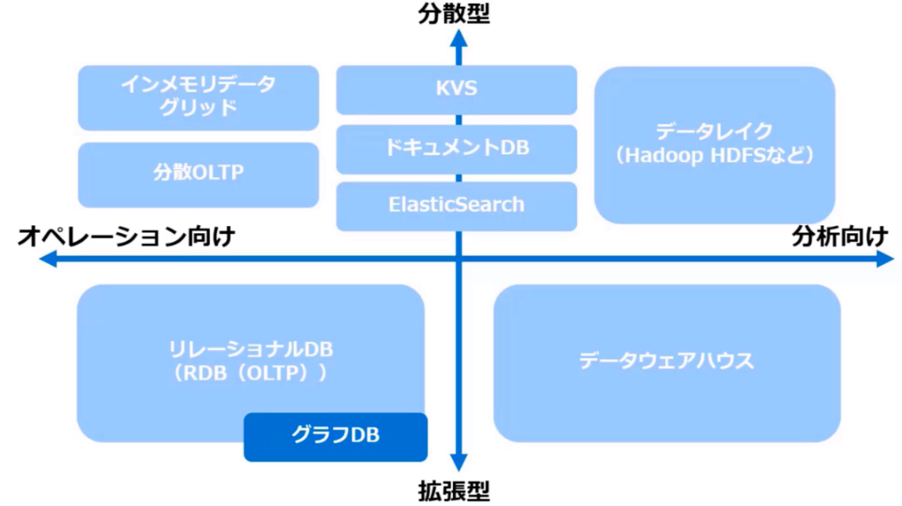
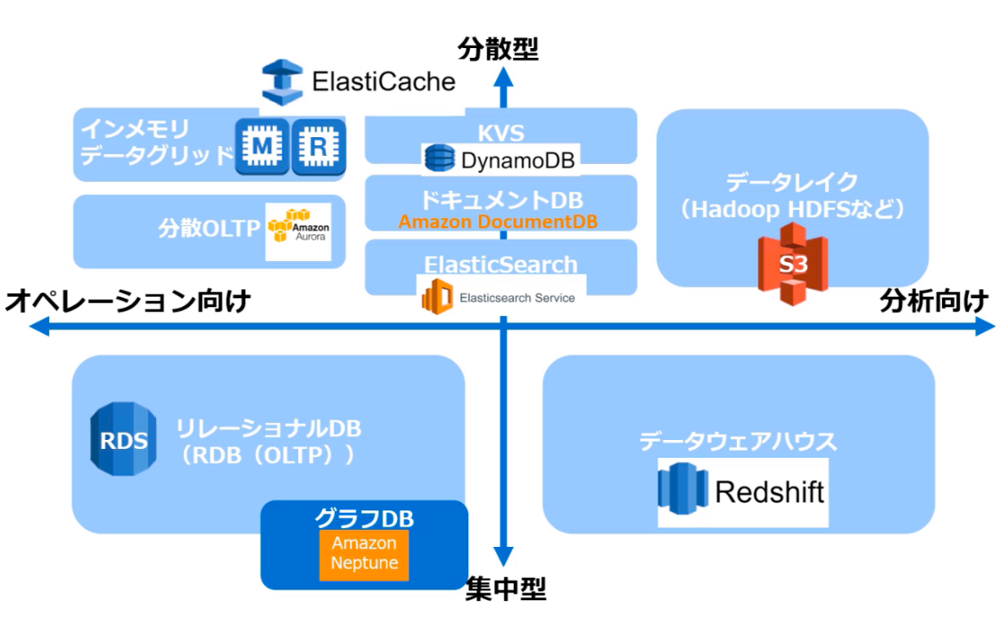
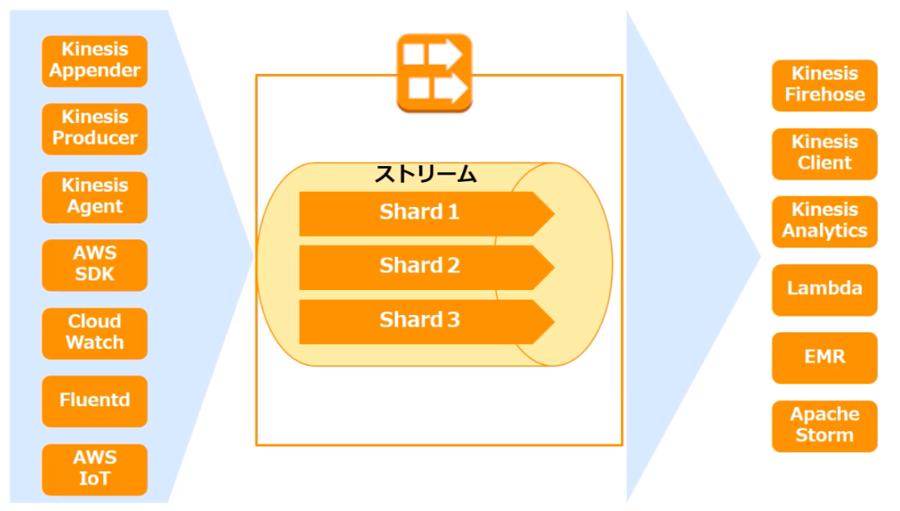
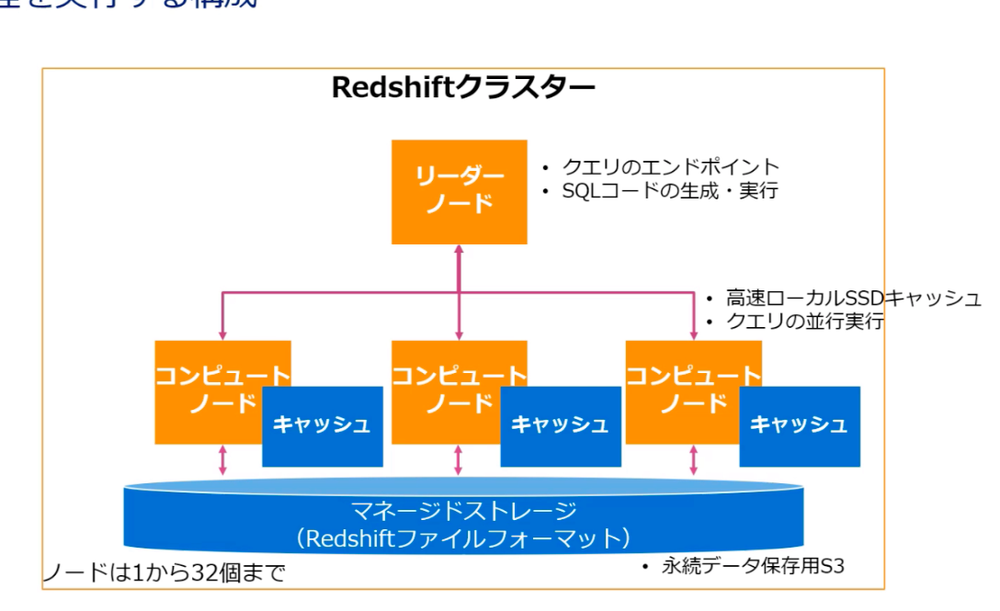

# データベース

## 最適なデータベース選択

- これまでDB：リレーショナルデータベース
- ビッグデータ向けDB：NoSQL

### NoSQL

- キーバリューストア
  - キーに対して値を入れる単純な構造
  - 高速なパフォーマンスと分散型拡張に優れている
  - データ読込が高速
- ワイドカラムストア
  - 列指向とも呼ばれ、キーを利用するがデータはカラムで管理する
  - 非構造データを大規模に格納することを目的にしている
  - 行ごとに任意の名前のカラムを無数に格納できる
- ドキュメントデータベース
  - キーに対してバリューではなく、JSONやXMLなどのデータを格納
  - 複雑なデータ構造を扱うアプリで生産高く柔軟に開発する
- グラフデータベース
  - グラフ理論に基づき、データ同士の関係をグラフで相互に結びついた要素で構成される
  - RDBと比較して高速横断検索が可能

### データベース全体像

### RDB

業務システム向けのDBの基本はRDB

- 概要
  - 業務システムなどで最も頻繫に利用されるオペレーション用のデータベース
  - 利用者はSQL等のクエリ言語でデータ操作を実施
- アーキテクチャ
  - テーブル間のリレーションが定義されたデータモデル
  - 行指向で一つの行をデータの塊として取り扱う
- 利用データ
  - 会計データなど業務系の構造化データ
- ソフトウェア
  - Oracle
  - MySQL
  - SQL Server
  - PostgresSQL
- AWSサービス
  - RDS

### データウェアハウス（DWH）

構造化データを利用した経営分析向けのデータベース

- 概要
  - データの抽出・集約に特化したBIデータ分析用のデータベース
  - 読み込むデータ構造を予め設計して、加工してから利用分のデータを蓄積
  - レスポンス重視データ抽出・集計が早いが、更新・トランザクションは遅い
- アーキテクチャ
  - データをパーティショニングして、複数ディスクから読み込む
  - 列指向でデータを格納
- 利用データ
  - 会計データなどの業務系の構造化データを分析ように加工、BIで利用
  - KPI測定/競合分析/アクセス分析等
- ソフトウェア
  - Exadata
  - VERTICA
  - TERADATA
  - Greenplum
- AWSサービス
  - Redshift

### 分散型DB

ビッグデータやIoTデータを蓄積して高速処理を可能にするDBとストレージの組み合わせ

- 概要
  - データ抽出に特化したDB
  - 分散してデータを保存しており、ビッグデータの高速処理むけ
- アーキテクチャ
  - SQLライクなクエリで操作可能
  - IUDはない
  - トランザクションはない
  - データ書き込みは一括ロードまたは全件削除のみ
- 利用データ
  - ビッグデータ
- ソフトウェア
  - Impala
  - presto
  - HDFS
- AWSサービス
  - S3

### KVS：キーバリュー型

シンプルなデータ構造にすることで高速処理を可能にしたDB

- 概要
  - 分散して、シンプルなオペレーションを高速に実施できるDB
- アーキテクチャ
  - 強い整合性を犠牲して、結果的な整合性を採用
  - 分散向けのデータモデル/クエリの採用
  - トランザクション/集計/JOINなど不可
- 利用データ
  - 大規模WEBサイトのバックエンドデータ
  - メッセージングシステムのデータ
  - 大規模書き込みが必要なIOTセンサーデータ等
- ソフトウェア
  - redis
  - riak
- AWSサービス
  - ElastiCache
  - DynamoDB

### ワイドカラム型

キーに対してカラムを大規模に登録できるのがワイドカラム型

- 概要
  - 分散して、シンプルなオペレーションを高速に実施できるDB
  - データ取得する際にデータ結合しなくても済むように、可能な限り多くデータを同じ行に保持
- アーキテクチャ
  - 結果整合性を採用
  - キースペース、カラムファミリー、ロウ、カラムの入れ子構造
  - SQLライクなデータ操作が可能
  - データ操作は挿入、削除、参照のみで、データの更新は挿入による上書き
- 利用データ
  - Facebook/Twitterなどソーシャルデータの位置情報データストレージ/リアルタイム分析/データマイニング処理
- ソフトウェア
  - cassandra
  - HBASE
- AWSサービス
  - DynamoDB

### ドキュメントデータベース

キーに対してドキュメント指向でXMLなどのデータを格納する

- 概要
  - ドキュメント指向データベースでは、様々なデータ構造のドキュメントを混在して保存することができる
- アーキテクチャ
  - JSON/XMLをデータモデルに利用
  - 小規模データの同期集計処理が可能だが、バッチは不向き
  - SQLライクなデータ操作が可能で、KVSよりもクエリが豊富なため操作しやすい
  - Shardingによるデータベース分散化
- 利用データ
  - 半構造化データ（XML/JSON）
  - 大規模WEBログ保管等
  - オンラインゲームデータ
  - カタログ管理
- ソフトウェア
  - mongoDB
  - MarkLogic
  - CouchDB
  - Couchbase
- AWSサービス
  - Amazon DocumentDB + mongoDB

### インメモリデータグリッド

KVSの仕組みをメモリを利用してより高性能にしたDB

- 概要
  - 大量のデータを多数のサーバのメモリ上で分散して管理する技術
  - ミリ秒単位の高速の応答処理が可能
- アーキテクチャ
  - データをメモリ上に置くことで、高速なデータアクセスを実現
  - データを多数のサーバで分散して管理
- 利用データ
  - 金融の取引処理データでミリ秒以下の応答時間を実現
- ソフトウェア
  - GEODE
  - Oracle Coherence
  - hazelcast
  - Ignite
  - Infinispan
- AWSサービス
  - Redis ElastiCache
  - Memcached ElastiCache

### 全検索型エンジン×分散DB

データの全検索エンジンであるElasticsearchは分散データベースと連携してデータ全検索処理が可能

- 概要
  - 全検索型のデータ検索エンジンで、分散データベースと連携して検索データベースを構築
  - 検索条件との関係性/関連性が高いデータを抽出して返す
- アーキテクチャ
  - Elasticsearchは全文検索用のライブラリApache Luceneを利用したデータストア
  - 分析の柔軟性や速度が高く、分析/蓄積/可視化環境を容易に構築可能
- 利用データ
  - 半構造化データ（XML/JSON）
  - 高可用な全検索エンジン
  - サイト内データの検索
  - デバイス登録状況・配信状況のリアルタイム可視化等リアルタイムの検索要件/検索行動の可視化
- ソフトウェア
  - elasticsearch
  - kibana
- AWSサービス
  - Elasticsearch Service

### グラフDB

グラフ構造でデータ間のつながりを検索・可視化するDB

- 概要
  - グラフ演算に特化したDBで、データ間のつながりを検索・可視化に利用
- アーキテクチャ
  - グラフデータ構造を取るため、RDB以上にスケールアウトができない
  - レコード数が増えると、検索にかかる時間と難易度が増大
  - ACID特性が担保されており、オブジェクト間の関連づけを簡単に表現できる
- 利用データ
  - 最短経路探索
  - 禁輸取引の詐欺検出
  - ソーシャルネットワークによるリレーション計算
- ソフトウェア
  - neo4j
- AWSサービス
  - Amazon Neptune

### 分散OLTP

オンライントランザクション処理を分散化する次世代DB

- 概要
  - グローバルに分散され、強整合性を備えたデータベース
- アーキテクチャ
  - リレーショナルデータベースの構造と非リレーショナルデータベースの分散スケーラビリティを兼ね備える
  - 高い可用性、高性能のトランザクションと強整合性が実現
- 利用データ
  - 大規模な業務データ処理
- AWSサービス
  - Amazon Aurora

## DynamoDB

完全マネージド型のNoSQLデータベースサービス

### 特徴

- ハイスケーラブルで無制限に性能を拡張できる
- 負荷が高くなっても応答速度が低下しない低レイテンシ
- 高可用性
- マネージド型のためメンテナンスフリー
- ポロビジョンドスループット：テーブルごとにReadとWriteに、必要なスループットキャパシティーを割り当てる
- ストレージの容量制限がない

### 出来ること

キーバリューでデータを簡易に操作することが主要な役割

- 出来ること
  - キーに対するバリューのCRUD操作
  - 簡易なクエリやオーダー
- できないこと/向いていないこと
  - JOIN/TRANSACTION/COMMIT/ROLLBACKは不可
  - 詳細なクエリやオーだ
  - 大量データ読み込みにはコストがかかる

### DynamoDBの整合性モデル

デフォルトで結果整合性モデルであり、一部処理に強い整合性モデルを利用している

- Write：少なくとも二つのAZでの書き込み完了が確認取れた時点で完了
- Read:
  - デフォルト：結果整合性モデル、最新の書き込み結果が即時読取処理に反映されない可能性がある
  - オプション：強い整合性モデル、GetItem/Query/Scanでは強い整合性のある読み込みオプションが指定可能

### ユースケース

ビッグデータ処理向けか大量データ処理が必要なアプリケーション向けに利用する

- ビッグデータ：
  - 大量データを収集・蓄積・分析するためのデータベースとして活用
  - Hadoopと連携してビッグデータ処理が可能
- アプリケーション：
  - 大規模サービスでのデータ高速処理が必要なアプリケーション向けに活用
  - 多数のユーザが一度にアクセスするようなアプリケーションのデータ処理など
- ユーザ行動データ管理：
  - ユーザ情報やゲーム、広告等のユーザ行動データ向けDB
  - ユーザIDごとに複数の行動履歴管理
- バックエンドデータ処理：モバイルアプリのバックエンド/バッチ処理のロック管理/フラッシュマーケティング/ストレージのインデクス

### インデクス

DynamoDBは暗黙的に設定するKVSにおけるKeyに値するものと、明示的に設定するキーがインデクスとして利用でききる

- 暗黙的なキー：データを一意に特定するために暗黙的にキー（ハッシュキーやレンジキー）として宣言して検索に利用するインデクスで、１テーブルい一つ宣言する
- 明示的なキー
  - ローカル・セカンダリ・インデクスはプライマリキーのタイプがハッシュキーやレンジキーの場合に追加で別のレンジキーを増やすようなイメージ１テーブルに五つ作成可能/テーブル作成時に作成
  - グローバル・セカンダリ・インデクスは別のハッシュキーを設定することができる。全データに対してグローバルに付与、一テーブルに五つ作成可能/テーブル作成後に作成

### プライマリキー

DynamoDBはハッシュキーとレンジキーという2種類のプライマリキーを利用する

- ハッシュキーキー
  - KVSにおけるキーに相当するデータを一意に特定するためのIDなどのこと
  - テーブル作成時に一つの属性を選び、ハッシュキーとして宣言
  - ハッシュ関数によってパーティションを決定するためハッシュキーと呼ぶ
  - ハッシュキーは単独での重複を許さない
- レンジキー
  - ハッシュキーにレンジを加えたものをレンジキーまたは複合キーと呼ぶ
  - テーブル作成時に二つの属性を選び、一つをハッシュキーとして、もう一つをレンジキーと呼ばれるキーとして宣言
  - 二つの値の組み合わせによって、一つの項目を特定
  - 複合キーは、単独であれば重複が許される

### 明示的に利用するインデクス

ハッシュキーやレンジキーだけでは検索要件が満たせない場合LSIとGSIを利用する

- LSI：
  - レンジキー以外で絞り込み検索を行うインデクスで、複合キーテーブルに設定出来る
  - 複合キーによって整理されている項目に対して、別の規則でのインデクスを可能にする
- GSI：
  - ハッシュキーの属性の代わりになる
  - ハッシュキーテーブルおよび複合キーテーブルどちらにでも設定可能
  - ハッシュキーをまたいで自由に検索が出来るようにする

### DynamoDB Streams

DynamoDBテーブルに保存された項目の追加・変更・削除の発生時の履歴をキャプチャ出来る機能

- データの保存
  - 過去24時間以内のデータ変更の履歴を保存し、24時間を経過すると消去される
  - データ容量はマネージド型で自動的に管理
- データ保存の順番
  - 操作が実施された順番に応じてデータはシリアライズされる
  - 特定のハッシュキーに基づいた変更は正しい順番で保存されるが、ハッシュキーが異なる場合は受信した順番が前後される可能性がある。

### DynamoDB Streamsのユースケース

データ更新をトリガーとしたアプリケーション機能やレプリケーションに活用出来る

- グロスリージョンレプリケーション：ストリームによるキャプションをトリガーとしてクロスリージョンレプリケーションを実施することが可能
- データ更新をトリガーとしたアプリケーション機能：データ更新に応じた通知処理等のアプリケーション処理の実行

### DynamoDB Accelerator

DAXはDynamoDBにインメモリキャッシュ型の機能を付加する

- インメモリキャッシュとして１桁台のミリ秒単位からマイクロ秒単位まで結果整合性のある読み込みワークロードの応答時間が短縮。マルチAZDAXクラスターは１秒間に数百万のリクエストを処理できる
- DAXはDynamoDBを使用するAPIと互換性を持つマネージド型サービスあり、運用上そしてアプリケーションの複雑性を減少させて容易に導入可能
- 読取の多いワークリストや急激に増大するワークロードに対して、DAXはスループットを強化したり、読み込みキャパシティユニットを必要以上にプロビジョニングしないように設計することで運用コストの節約できる

### グローバルテーブル

リージョン間で同期されるマルチマスターテーブルを作成可能

- DynamoDBの性能のまま、世界中で複数のリージョンにエンドポイントを持つことが出来る
- 読み書きのキャパシティに加えて、クロスリージョンレプリケーションのデータ転送料金に課金される
- オプションで実施出来た強い整合性が不可

### オンデマンドバックアップ

パフォーマンスに影響なく数百TBのバックアップを実行可能

- 任意のタイミングで利用可能な長期間データ保存用バックアップ
- 従来はデータパイプラインを利用して取得したバックアップを容易に実施できるようになった

## Aurora

- Amazonがクラウド時代に適したリレーショナルデータベースのを一から考えて構築された新RDB
- その特徴はNoSQL型の分散高速処理とRDBとしてのデータ操作性を両立させたこと

### Auroraの特徴

1. 高い並列処理性能によって大量の読み書きをするのに適したDB
   - 高い並列処理によるストレージアクセスによってクエリを高速処理することが可能
   - Auroraは大量の書き込みや読み込みを同時に扱うことができる
   - データベースの集約やスループット向上が見込まれる
   - ただし、すべてが５倍高速というわけではなく、適用すべき領域をみつけてりようする
2. MySQL/PostgreSQLと互換性があり、同じ操作方法とそのコミュニケーションを利用することが可能
   - 耐久性/自己回復性
     - 三つのAZに二つのコピーを設置可能で、合計六つのコピーを保持
     - 過去のデータがそのままS3に継続的バックアップ
     - リストアも差分適用がなく高速
     - どのタイミングでも安定したリストア時間を実現
     - 99.99%の高可用性、高耐久性
   - スケーラビリティ
     - 10㎇から最大64TBを提供するSSDデータプレーンを利用してシームレスに拡張可能
     - Auto-Scalingなどのクラウド独自のスケーラブルが可能
     - 最大15のリードレプリカを利用した高速読み込みが可能

### Auroraサーバレス

予測困難なアプリケーションワークロードに対応したAuroraのオンデマンド自動スケーリング構成

### AuroraグローバルDB

他リージョンに対する高性能なリードレプリカ作成機能

- ログ転送ではなく、ストレージレベルのレプリケーション機能を利用してレプリケーションを実施
- 1秒以下/最大でも5秒でレプリケーションを実行する低レイテンシレプリケーションを実現

### Auroraのユースケース

- 大規模なクエリデータ処理
  - 書き込みが多くでトランザクション量が多い
  - クエリ並行度が高い、データサイズが大きいケースで効果を発揮する
  - コネクション数やテーブル数が多いデータベース処理
- 運用の容易さを活用する
  - スケーラビリティの高さやデータ容量が無制限に拡張出来る
  - レピュテーションなどの性能高さ

## EFS

### EFSの特徴

- シンプル：
  - フルマネージド型サービス
  - ネットワークファイルシステム４（NFS v4）プロトコルを利用して、関連ツールや標準プロトコル/APIアクセス可能
- スケーラブル：
  - ペタバイトまでスケーラブルにデータを蓄積
  - スループット/IOPS性能は自動的にスケーリングし、低レイテンシを維持
- 柔軟性：
  - ファイルの減少に合わせて自動で拡張・縮小
  - 事前に容量を設定する必要なし
  - 使った分だけの従量課金

### 基本性能

何千もの同時アクセスが実現可能という性能が特徴

### マウントターゲット

EC2インスタンスからマウントターゲットを介して、AZ外にあるEFSにアクセス出来る

### EFSユースケース

複数EC2インスタンスでデータ共有する際はEFSをファーストチョイスする

### 三つのファイルストレージ

- EFS：
  - NASに似たファイルストレージ
  - ファイルシステムとして利用し、複数のEC2インスタンスでの共有アクセスが可能
  - S3と異なりインターネットから直接アクセスできない
- Amazon FSx For Windows File Server：
  - Windows File Serverと互換性のあるストレージ
  - Windows上に構築され、Windows AD、OSやソフトウェアとの連携が豊富に可能
- Amazon FSx For Lustre：
  - 分散型ファイルストレージであるLusterと互換性のある分散型の高速ストレージ
  - 機械学習などの高速コンピューティングのデータレイヤーに利用する一時保存用の処理用ストレージ

### Amazon FSx For Windows File Server

Windows File ServerをAWSクラウド上で利用したい場合に利用するストレージ

- 特徴・ユースケース
  - Windows File Serverのクラウド移行
  - Active Directory統合などの幅広い管理機能
  - SMBプロトコルによりEC2、VMWare Cloud on AWS、Amazon WorkSpaces、Amazon AppStream2.0インスタンスなど幅広く接続可能
  - 最大数千台のコンピューティングインスタンスからアクセス可能
- アーキテクチャ
  - ENI経由でアクセス
  - VPCセキュリティグループでの制御
  - 単一AZの単一サブネットを指定して構成する
  - 複数インスタンスでの共有や他AZ内のインスタンスからのアクセスも可能
  - マルチAZ構成を実施することも可能

### データ量への対応

AWSは大量なデータ処理への各段階において必要なサービスが提供されている。

1. 効率的なデータ蓄積：S3、Glacier、Glue
2. ストリームデータ処理：Kinesis
3. 大量データの解析手法：Athena、EMR、QuickSight、Redshift

## Kinesis

ストリームデータを収集・処理するためのフルマネージド型サービス

- Kinesis Data Streams：ストリームデータを処理するアプリケーションを構築
- Kinesis Data Firehouse：ストリームデータをS3やRedshiftなどへ簡単に配信
- Kinesis Data Analytics：ストリームデータを標準的なSQLクエリでリアルタイムに可視化・分析

### Kinesis Data Stream

Kinesis Streamのデータ提供側とデータ利用側に様々なサービスが利用可能

### Kinesis Data Firehose

各種DBに配信・蓄積するためのストリーム処理を実施する。Lambdaと連携するとETLとしても機能する。

ストリームデータを標準的なSQLクエリでリアルタイムに分析

## Redshift

高速でスケーラブルな費用対効果の高いマネージド型のＤＷＨ/データレイク分析サービス

### Redshiftの構成

クラスターというグループ単位で、複数ノードによってデータ処理を実行する構成

