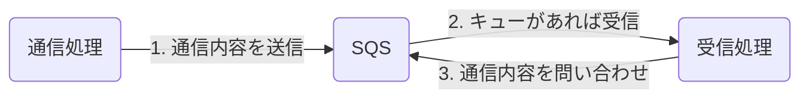
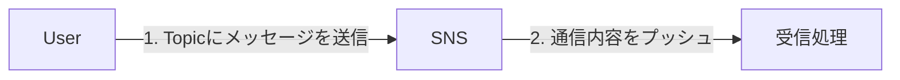

# サーバレス

## 概要

### 密結合の問題

密結合したアーキテクチャは障害や修正に弱く、不具合が発生しやすい

- デメリット
  - １インスタンスの障害の影響が全体に及びやすい
  - 一つの修正対応で他インスタンスへの影響を多く考慮しなければならない
  - 負荷対応やスケーリングなども容易にできない
  - システム構成の追加・変更が難しい

### 疎結合化のメリット

ELBやAPIなどを利用して結合点を削減したり、メッセージ結合にすることで影響を減らすことができる

- メリット
  - 耐障害性が強まる
  - 負荷対応やスケーリングなどが容易
  - システム構成の追加・変更が容易

### 疎結合設計

| 密結合設計パターン               | 疎結合設計パターン                       |
|--------------------------|------------------------------------|
| ユーザー認証・管理をバックエンドサーバで処理 | ユーザー認証・管理をIAMなどのマネージド型サービスを利用 |
| 通常のEC2インスタンスでアプリケーションを構成 | なるべくLambdaなどサービスでアプリケーションを構成       |
| アプリケーション間では直接通信         | アプリケーション間ではSQSなどMQ通信連携          |
| アプリケーション間では直接通信         | アプリケーション間ではSQSなどMQ通信連携          |

## SQS

プロセス間通信などのスレッド間通信に使われるコンポネントで制御やデータを伝達するポーリング型キューサービス

### ポーリングとは

複数のプロセス間通信に対し、一定のタイミングの問い合わせがあった場合に送受信を行う通信方式

### SQSの仕組み

### キューのタイプ

- 標準キュー：順番通りに処理と一回だけのメッセージングを**なるべく**実施する処理
- FIFOキュー：最初に入ったキューを最初に処理する順番を守るキューイングを実施

## SNS

フルマネージド型のプッシュ型通知サービスで他のサービスとの非同期通信を可能にする

送信側がトピックを作成して受信側をポリシー指定することで制御された非同期通信を実現する

### SNSとSQS

| SNS             | SQS             |
|-----------------|-----------------|
| メッセージは永続ではない  | メッセージは永続性あり  |
| プッシュ型配信方式  | ポーリング型配信方式 |
| プロヂューサーが発行    | プロヂューサーが送信    |
| コンシューマーがサブスクライブ | コンシューマーが送受信  |

## SES

フルマネージド型/サーバレス型のコスト効率に優れたメールサービス
